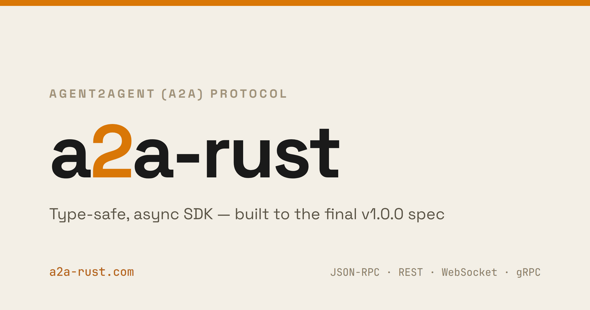

<!-- SPDX-License-Identifier: Apache-2.0 -->
<!-- Copyright 2026 Tom F. <tomf@tomtomtech.net> (https://github.com/tomtom215) -->

<p align="center">
  <a href="https://a2a-rust.com">
    <picture>
      <source media="(prefers-color-scheme: dark)" srcset="book/static/brand/og-card-editorial-dark.png">
      
    </picture>
  </a>
</p>

# a2a-rust — Agent2Agent (A2A) Protocol SDK for Rust

[](https://github.com/tomtom215/a2a-rust/actions/workflows/ci.yml)
[](https://github.com/tomtom215/a2a-rust/actions/workflows/tck.yml)
[](https://codecov.io/gh/tomtom215/a2a-rust)
[](https://crates.io/crates/a2a-protocol-sdk)
[](https://docs.rs/a2a-protocol-sdk)
[](https://a2a-rust.com)
[](LICENSE)
[](https://www.rust-lang.org)
[](docs/official-tck-findings.md)

Pure Rust implementation of the [**Agent2Agent (A2A) protocol**](https://a2a-protocol.org/), written against the **v1.0.0** wire specification — the open, vendor-neutral standard for AI-agent interoperability.

Build, connect, and orchestrate AI agents with a type-safe, async-first SDK spanning four transports — JSON-RPC 2.0, REST, WebSocket, and gRPC — for both client and server.

## About

The A2A protocol was originally developed by Google and [donated to the Linux Foundation](https://developers.googleblog.com/en/google-cloud-donates-a2a-to-linux-foundation/) in June 2025. The A2A project maintains its own [official SDKs](https://a2a-protocol.org/latest/sdk/) and publishes the specification and conformance suite this implementation is measured against.

**This is an independent project.** It is not affiliated with, endorsed by, or governed by the A2A project, the Linux Foundation, or Google, and it is not an official SDK. It tracks the published v1.0.0 specification and is graded against the A2A project's official Technology Compatibility Kit; where it falls short of that suite, [`docs/official-tck-findings.md`](docs/official-tck-findings.md) records exactly where and why.

## Features

### Protocol & Transport

| | |
|---|---|
| **A2A v1.0.0 wire types** | The spec's structs, enums, and fields, with serde annotations matched to the wire format |
| **Quad transport** | JSON-RPC 2.0, REST, WebSocket (`websocket`), and gRPC (`grpc`) — client and server |
| **SSE streaming** | Real-time `SendStreamingMessage` / `SubscribeToTask` with broadcast multi-subscriber event streams |
| **Push notifications** | Pluggable `PushSender` trait with HTTP webhook implementation |
| **Agent card discovery** | `/.well-known/agent-card.json` serving + client-side resolution; hot-reload via file polling or SIGHUP |
| **Agent card signing** | JWS/ES256 with RFC 8785 JSON canonicalization (`signing` feature) |
| **HTTP caching** | `ETag`, `Last-Modified`, `304 Not Modified` for agent card endpoints |

### Server Framework

| | |
|---|---|
| **Pluggable stores** | `TaskStore` / `PushConfigStore` traits; in-memory defaults + SQLite (`sqlite`) + PostgreSQL (`postgres`) with migrations |
| **Multi-tenancy** | Tenant-aware stores, `PerTenantConfig` for per-tenant limits, `TenantResolver` strategies (header, bearer, path) |
| **Executor ergonomics** | `agent_executor!` macro, `EventEmitter`, `boxed_future` — no manual `Pin<Box<dyn Future>>` |
| **Interceptors** | Client `CallInterceptor` + server `ServerInterceptor` chains for auth, logging, etc. |
| **State validation** | `TaskState::can_transition_to()` enforces valid state machine transitions |
| **Rate limiting** | Built-in `RateLimitInterceptor` with fixed-window per-caller limiting |
| **Graceful shutdown** | `RequestHandler::shutdown()` cancels all tokens and destroys queues |
| **Server startup** | `serve()` / `serve_with_addr()` reduce ~25-line hyper boilerplate to one call |

### Client

| | |
|---|---|
| **Retry policy** | Configurable `RetryPolicy` with jittered exponential backoff (connection errors, timeouts, 429/502/503/504) |
| **TLS support** | HTTPS via `rustls`, no OpenSSL dependency — on by default in the client/SDK (`tls-rustls`; opt out with `default-features = false`), and the server's push sender delivers to HTTPS webhooks with it |
| **Axum integration** | Feature-gated `A2aRouter` for idiomatic Axum servers (`axum` feature) |
| **Zero framework lock-in** | Core built on raw `hyper` 1.x; Axum optional, or bring your own |

### Observability & Operations

| | |
|---|---|
| **OpenTelemetry** | Native OTLP metrics export — request counts, latency histograms, error rates, queue depth, pool stats (`otel` feature) |
| **Metrics trait** | Pluggable callbacks for requests, responses, errors, latency, and connection pool statistics |
| **Tracing** | Structured logging via `tracing` crate, zero cost when disabled |
| **Request ID propagation** | `CallContext::request_id` auto-extracted from `X-Request-ID` header |

### Security & Hardening

| | |
|---|---|
| **Request hardening** | Body size limits, Content-Type validation, path traversal protection, query length limits, health endpoints |
| **SSRF protection** | Push webhook URL validation, header injection prevention, SSE memory limits |
| **CORS support** | `CorsConfig` for browser-based clients with preflight handling |
| **Executor timeout** | Configurable via `RequestHandlerBuilder::with_executor_timeout()` to kill hung executors |
| **Task eviction** | TTL-based eviction, capacity limits, amortized sweeps, cursor-based pagination |

### Quality

| | |
|---|---|
| **Mutation-tested** | `cargo-mutants` runs on every pull request (incremental, changed-files only) and fails the build if any mutant goes undetected by the test suite; mutants that time out are reported separately in the job summary rather than failing the build. A full-sweep matrix runs on demand |
| **No `unsafe`** | `#![forbid(unsafe_code)]` at every library crate root; zero `unsafe` blocks in `crates/`, `tck/`, or the benches harness |
| **Regression-gated benchmarks** | Pull requests run `transport_throughput` and `protocol_overhead` twice (base branch vs PR) and fail when the 95 %-CI lower bound of a benchmark's median regression exceeds 50 % (default; individually noisy benchmarks carry documented per-benchmark overrides, e.g. `from_str/16384` at 75 %) — only statistically confident, substantial regressions trip the gate. See [`book/src/reference/regression-gate.md`](book/src/reference/regression-gate.md) for the threshold's derivation and the runner-noise limitations behind it |
| **Conformance-gated** | The in-repo conformance runner grades all four bindings — JSON-RPC, REST, WebSocket, and gRPC — plus cross-binding equivalence, on every push to `main` and every pull request. Measurement against the A2A project's *official* TCK is reported separately under [Project Status](#project-status), including what that suite does not cover |

## Crate Structure

| Crate | Purpose | When to Use |
|---|---|---|
| [`a2a-protocol-types`](crates/a2a-protocol-types) | All A2A wire types — `serde` only, no I/O | You need types without the HTTP stack |
| [`a2a-protocol-client`](crates/a2a-protocol-client) | HTTP client for A2A requests | Building an orchestrator, gateway, or test harness |
| [`a2a-protocol-server`](crates/a2a-protocol-server) | Server framework for A2A agents | Building an agent that handles A2A requests |
| [`a2a-protocol-sdk`](crates/a2a-protocol-sdk) | Umbrella re-export + prelude | Quick-start / full-stack usage |

`a2a-protocol-client` and `a2a-protocol-server` are **siblings** — neither depends on the other. Use only what you need.

## Quick Start

### Add the dependency

```toml
[dependencies]
a2a-protocol-sdk = "0.8"
tokio = { version = "1", features = ["rt-multi-thread", "macros"] }
```

### Implement an agent

```rust
use a2a_protocol_sdk::prelude::*;

struct MyAgent;

// The agent_executor! macro eliminates Pin<Box<dyn Future>> boilerplate
agent_executor!(MyAgent, |ctx, queue| async {
    let emit = EventEmitter::new(ctx, queue);

    emit.status(TaskState::Working).await?;
    emit.artifact("result", vec![Part::text("Hello from my agent!")], None, Some(true)).await?;
    emit.status(TaskState::Completed).await?;

    Ok(())
});
```

> **Note:** `AgentExecutor` is object-safe — methods return `Pin<Box<dyn Future>>`.
> This means `RequestHandler`, `RestDispatcher`, and `JsonRpcDispatcher` are **not generic**;
> they store the executor as `Arc<dyn AgentExecutor>` for easy composition.

### Start a server

```rust
use std::sync::Arc;
use a2a_protocol_sdk::prelude::*;

let handler = Arc::new(
    RequestHandlerBuilder::new(MyAgent)
        .with_agent_card(agent_card)
        .build()
        .expect("build handler"),
);

// One-liner server startup (replaces ~25 lines of hyper boilerplate)
serve("0.0.0.0:3000", JsonRpcDispatcher::new(handler)).await?;
```

### Use the client

```rust
use a2a_protocol_sdk::prelude::*;

let client = ClientBuilder::new("http://localhost:8080")
    .with_retry_policy(RetryPolicy::default())  // automatic retry on transient errors
    .build()
    .expect("build client");

// Synchronous request
let response = client
    .send_message(params)
    .await
    .expect("send_message");

// Streaming request
let mut stream = client
    .stream_message(params)
    .await
    .expect("stream_message");

while let Some(event) = stream.next().await {
    match event? {
        StreamResponse::StatusUpdate(ev) => println!("Status: {:?}", ev.status.state),
        StreamResponse::ArtifactUpdate(ev) => println!("Artifact: {}", ev.artifact.id),
        StreamResponse::Task(task) => println!("Task: {}", task.id),
        StreamResponse::Message(msg) => println!("Message: {:?}", msg),
        // StreamResponse is #[non_exhaustive] — always keep a catch-all.
        _ => {}
    }
}
```

## Examples

### Incident-Response Agent Team (start here)

The hands-on answer to "how is an agent different from a wrapped prompt?":
three cooperating agents triage a production incident — a vague alert parks
the task in `INPUT_REQUIRED`, the operator's answer resumes the *same task*,
the orchestrator delegates to a deterministic log-search agent and an
LLM-backed runbook agent over real A2A calls, progress streams live, the
incident report lands as an artifact, and a parked task can be cancelled.
Runs fully local with Qwen3.5-0.8B (a ~500 MB Apache-2.0 model, via llama-server or Ollama) or
with no model at all:

```bash
cargo run -p incident-response
```

### Agent Team (Full Dogfood)

A 4-agent team that exercises the SDK broadly — 81 base E2E tests (94 with all optional features: WebSocket, gRPC, Axum, SQLite, signing, and OTel) covering all four transports (JSON-RPC, REST, WebSocket, gRPC), streaming, push notifications, agent-to-agent orchestration, cancellation, concurrency stress, multi-tenancy, large payloads, metrics, SDK regression testing, batch JSON-RPC, auth rejection, extended/dynamic agent cards, HTTP caching, backpressure, agent card signing, Axum framework integration, and SQLite-backed stores:

```bash
cargo run -p agent-team

# With all optional features
cargo run -p agent-team --features grpc,websocket,axum,sqlite,signing,otel
```

### Hello Agent (smallest complete agent)

The whole SDK in one screen — 35 lines, one dependency (`a2a-protocol-sdk`), no
feature flags. It greets whoever sends it a message:

```bash
cargo run -p hello-agent

curl -X POST http://127.0.0.1:3000 \
  -H 'content-type: application/json' -H 'A2A-Version: 1.0' \
  -d '{"jsonrpc":"2.0","id":1,"method":"SendMessage","params":{
        "message":{"messageId":"m1","role":"ROLE_USER","parts":[{"text":"Tom"}]}}}'
```

It doubles as the regression test for the Quick Start above: it depends on
exactly what the Quick Start tells you to depend on, so if that snippet stops
compiling, `cargo build -p hello-agent` fails with it.

### Echo Agent

A minimal example demonstrating both JSON-RPC and REST transports with synchronous and streaming modes:

```bash
cargo run -p echo-agent
```

### Multi-Language Agent Team

A Rust coordinator agent that delegates to worker agents written in Python, JavaScript, Go, and Java — proving cross-language A2A interoperability:

```bash
# Start the ITK worker agents first (see itk/README.md), then:
cargo run -p multi-lang-team
```

### AI Framework Integrations

Real LLM agents behind the A2A protocol — both pass the TCK 20/20 and run
against hosted providers or any local OpenAI-compatible server, with
honest failure semantics (provider errors fail the task; they are never
disguised as successful artifacts):

```bash
# rig AI framework (https://github.com/0xPlaygrounds/rig)
OPENAI_API_KEY=sk-... cargo run -p rig-a2a-agent

# genai multi-provider LLM client (https://crates.io/crates/genai)
GENAI_MODEL=gpt-4o-mini cargo run -p genai-a2a-agent
```

### Technology Compatibility Kit (TCK)

A standalone conformance test runner that validates any A2A server against
the protocol spec over the JSON-RPC and REST bindings (the gRPC and
WebSocket transports are covered by the agent-team E2E tests instead):

```bash
# Test a local server
cargo run -p a2a-tck -- --url http://localhost:8080 --binding jsonrpc

# Run the full cross-language ITK (requires Docker)
docker compose -f itk/docker-compose.yml up --build --abort-on-container-exit
```

## Architecture

```
┌────────────────────────────────────────────┐
│  Your Code                                 │
│  implements AgentExecutor or uses Client   │
└─────────────────────┬──────────────────────┘
                      │
┌─────────────────────▼──────────────────────┐
│  a2a-protocol-server / a2a-protocol-client │
│ RequestHandler · AgentExecutor · A2aClient │
└─────────────────────┬──────────────────────┘
                      │
┌─────────────────────▼──────────────────────┐
│  Transport Layer                           │
│  JsonRpcDispatcher · RestDispatcher        │
│  A2aRouter (axum, feature-gated)           │
│  WebSocketDispatcher (feature-gated)       │
│  GrpcDispatcher (feature-gated)            │
│  JsonRpcTransport · RestTransport          │
│  WebSocketTransport (feature-gated)        │
│  GrpcTransport (feature-gated)             │
└─────────────────────┬──────────────────────┘
                      │
┌─────────────────────▼──────────────────────┐
│  hyper 1.x · HTTP/1.1 + HTTP/2             │
└────────────────────────────────────────────┘
```

The server uses a 3-layer architecture:
1. **You implement `AgentExecutor`** — your agent logic, produces events via `EventQueueWriter`
2. **`RequestHandler` orchestrates** — manages tasks, stores, push notifications, interceptors
3. **Dispatchers handle HTTP/gRPC** — `JsonRpcDispatcher` (JSON-RPC 2.0), `RestDispatcher` (REST), `A2aRouter` (Axum), `WebSocketDispatcher` (WebSocket), and `GrpcDispatcher` (gRPC) wire hyper/tonic/axum to the handler

## Supported Methods

| Method | JSON-RPC | REST |
|---|---|---|
| `SendMessage` | POST | `POST /message:send` |
| `SendStreamingMessage` | POST → SSE | `POST /message:stream` |
| `GetTask` | POST | `GET /tasks/{id}` |
| `ListTasks` | POST | `GET /tasks` |
| `CancelTask` | POST | `POST /tasks/{id}:cancel` |
| `SubscribeToTask` | POST → SSE | `GET\|POST /tasks/{id}:subscribe` |
| `CreateTaskPushNotificationConfig` | POST | `POST /tasks/{id}/pushNotificationConfigs` |
| `GetTaskPushNotificationConfig` | POST | `GET /tasks/{id}/pushNotificationConfigs/{configId}` |
| `ListTaskPushNotificationConfigs` | POST | `GET /tasks/{id}/pushNotificationConfigs` |
| `DeleteTaskPushNotificationConfig` | POST | `DELETE /tasks/{id}/pushNotificationConfigs/{configId}` |
| `GetExtendedAgentCard` | POST | `GET /extendedAgentCard` |

## Testing

```bash
# Run the test suite (~2,740 tests with --all-features; CI runs sixteen feature combinations)
cargo test --workspace --all-features

# Run the end-to-end example
cargo run -p echo-agent

# Lint and format checks
cargo clippy --workspace --all-targets -- -D warnings
cargo fmt --all -- --check

# Build documentation
RUSTDOCFLAGS="-D warnings" cargo doc --workspace --no-deps

# Run benchmarks (Criterion suites ×14 — transport, protocol,
# lifecycle, concurrency, cross-language, realistic, error paths, backpressure,
# data volume, memory, enterprise, production, advanced scenarios, and
# coordinator chain under fault — the last is the only agent-level one,
# see book/src/reference/benchmarks.md for caveats on how to read it)
cargo bench -p a2a-benchmarks

# Mutation testing (requires cargo-mutants and cargo-nextest).
# --test-tool=nextest is not optional: .config/nextest.toml supplies the
# per-test kill that stops a hung mutant reporting TIMEOUT instead of caught.
# See book/src/deployment/testing.md for the full CI invocation.
cargo mutants --workspace --test-tool=nextest -- --all-features

# Fuzz JSON deserialization (requires nightly)
cd fuzz && cargo +nightly fuzz run json_deser
```

## Project Status

Published as `0.x`. All 11 A2A methods are implemented across the four transports, alongside HTTP caching, agent-card signing, optional `tracing` and OpenTelemetry, TLS, and the request-hardening features listed above. The API is still stabilizing — minor versions may carry breaking changes, as described under [Stability](#stability). [`docs/implementation/plan.md`](docs/implementation/plan.md) covers the implementation history and beyond-spec extensions.

Against the A2A project's official Technology Compatibility Kit, **92 of 114 MUST requirements pass and none fail**. Of the remaining 22, 21 have no test function in the upstream suite and one (`CARD-EXT-002`) is structurally inapplicable — so they are unmeasured rather than passing. [`docs/official-tck-findings.md`](docs/official-tck-findings.md) has the per-requirement breakdown and reproduction steps; [§16](docs/official-tck-findings.md#16-what-the-21-not-tested-musts-actually-are-one-family-at-a-time) accounts for the 21 family by family — six the upstream suite tags unautomatable, two it has ruled out of scope, and thirteen open backlog items in its own tracker — and shows why none can be closed from this repository.

[ROADMAP.md](ROADMAP.md) is the honest counterpart to this section: it records where this project's own gates do not yet measure everything they appear to, which conformance claims rest on the in-repo runner rather than the official suite, and which questions are still undecided. Worth reading before depending on this SDK for anything load-bearing.


## Stability

All crates follow [Semantic Versioning 2.0.0](https://semver.org/). During the `0.x` series, minor versions may include breaking changes as the API stabilizes. Protocol enums and key structs that can grow with the A2A specification are marked `#[non_exhaustive]` to allow forward-compatible additions in patch releases; the two deliberate exceptions are closed sets fixed by their underlying standards (`ApiKeyLocation` — OpenAPI's header/query/cookie — and `JsonRpcResponse` — JSON-RPC 2.0's result/error), which stay exhaustive so consumers can match them completely.

## Minimum Supported Rust Version

Rust **1.93** or later (stable).

## Contributing

Contributions are welcome — see [CONTRIBUTING.md](CONTRIBUTING.md) for coding
standards, testing requirements, and quality gates, and
[GOVERNANCE.md](GOVERNANCE.md) for how decisions get made. Participation is
governed by the [Code of Conduct](CODE_OF_CONDUCT.md) (Contributor Covenant
2.1).

[ROADMAP.md](ROADMAP.md) lists what is committed for upcoming releases,
alongside the verification gaps and open questions noted under
[Project Status](#project-status).

Every commit must be signed off under the
[Developer Certificate of Origin](DCO) (`git commit -s`) by a human git author;
CI enforces this. [PROVENANCE.md](PROVENANCE.md) documents this project's use
of AI coding assistants, the provenance of third-party material in the tree,
and the blanket DCO certification covering commits made before the DCO was
adopted.

To report a security vulnerability, follow [SECURITY.md](SECURITY.md) — not the
public issue tracker.

## License

Apache-2.0 — see [LICENSE](LICENSE), and [NOTICE](NOTICE) for the project's
copyright notice and third-party attributions.
