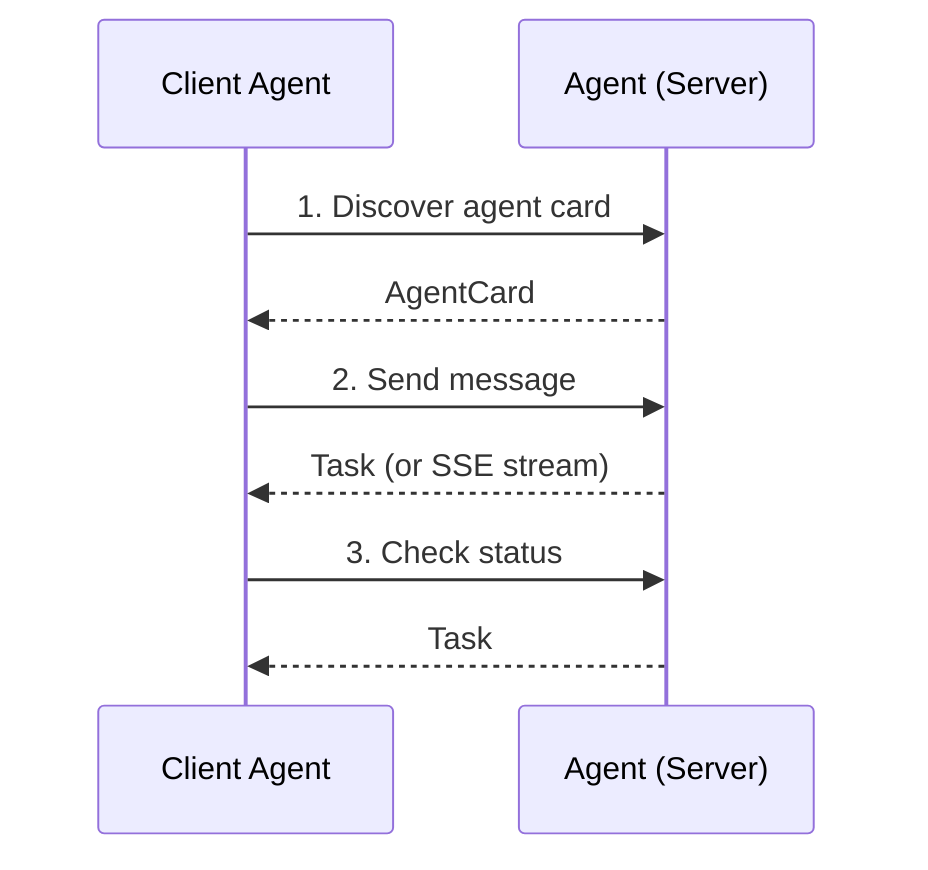
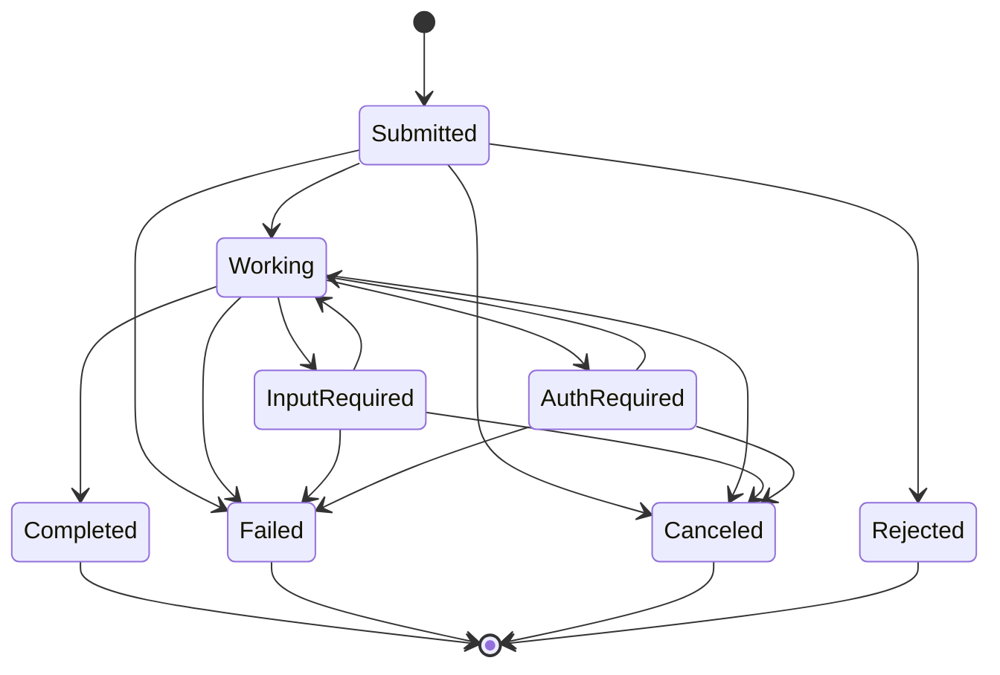
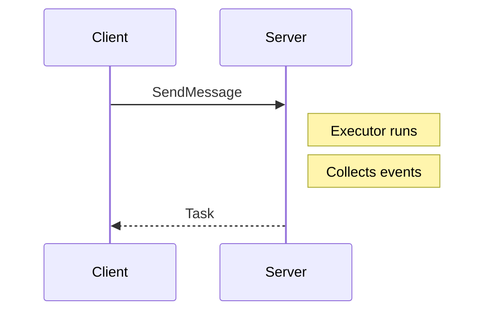
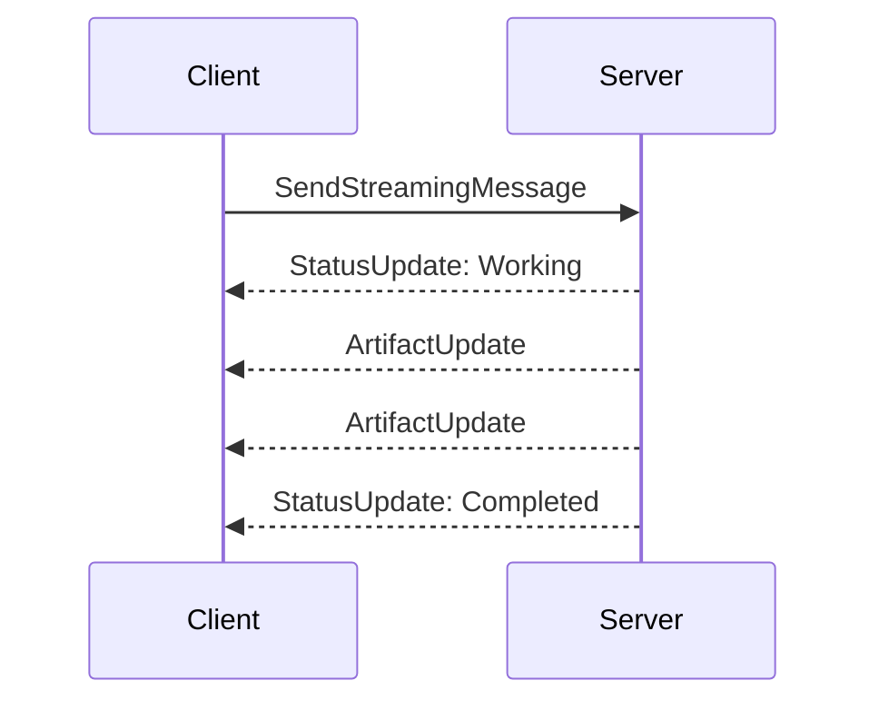

# Protocol Overview

The A2A (Agent-to-Agent) protocol defines how AI agents discover each other, exchange messages, manage task lifecycles, and stream results. This page covers the conceptual model — the "what" before the "how."

## The Big Picture

An A2A interaction follows this flow:

1. **Discovery** — The client fetches the agent's card from `/.well-known/agent.json`
2. **Communication** — The client sends a message and receives results
3. **Management** — The client can query, cancel, or subscribe to tasks

## Core Entities

### Tasks

A **Task** is the central unit of work. When a client sends a message, the server creates a task that progresses through well-defined states:

Terminal states (Completed, Failed, Canceled, Rejected) are final — no further transitions are allowed.

### Messages

A **Message** is a structured payload sent between agents. Each message has:

- A unique **ID** (`MessageId`)
- A **role** — `User` (from the client) or `Agent` (from the server)
- One or more **Parts** — the actual content

### Parts

A **Part** is a content unit within a message. Four content types are supported:

| Type | Description | Example |
|------|-------------|---------|
| `Text` | Plain text | `"Summarize this document"` |
| `Raw` | Base64-encoded binary | Image data, audio clips |
| `Url` | URL reference | `"https://example.com/doc.pdf"` |
| `Data` | Structured JSON | `{"table": [...], "columns": [...]}` |

### Artifacts

An **Artifact** is a result produced by an agent. Like messages, artifacts contain parts. Unlike messages, artifacts belong to a task and can be delivered incrementally via streaming.

### Agent Cards

An **Agent Card** is the discovery document that describes an agent — its name, capabilities, skills, and how to connect. Think of it as a machine-readable business card.

## Request/Response Model

A2A supports two communication styles:

### Synchronous (SendMessage)

The client sends a message and blocks until the task is complete:

### Streaming (SendStreamingMessage)

The client sends a message and receives events in real time via SSE:

Streaming is ideal for long-running tasks where the client wants progress updates.

## Contexts and Conversations

Tasks exist within a **Context** — a conversation thread. Multiple tasks can share the same context, allowing agents to maintain conversational state across interactions.

When a client sends a message with a `context_id`, the server groups that task with previous tasks in the same context. If no `context_id` is provided, the server creates a new one.

## Multi-Tenancy

A2A supports **multi-tenancy** via an optional `tenant` field on all requests. This allows a single agent server to serve multiple isolated tenants, each with their own tasks and configurations.

In the REST transport, tenancy is expressed as a path prefix: `/tenants/{tenant-id}/tasks/...`

## Next Steps

- **[Transport Layers](./transport-layers.md)** — JSON-RPC vs REST, and when to use each
- **[Agent Cards & Discovery](./agent-cards.md)** — How agents describe themselves
- **[Tasks & Messages](./tasks-and-messages.md)** — Deep dive into the data model
